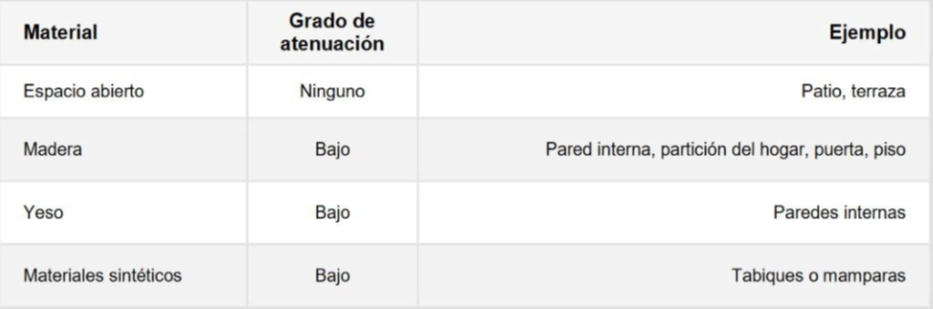
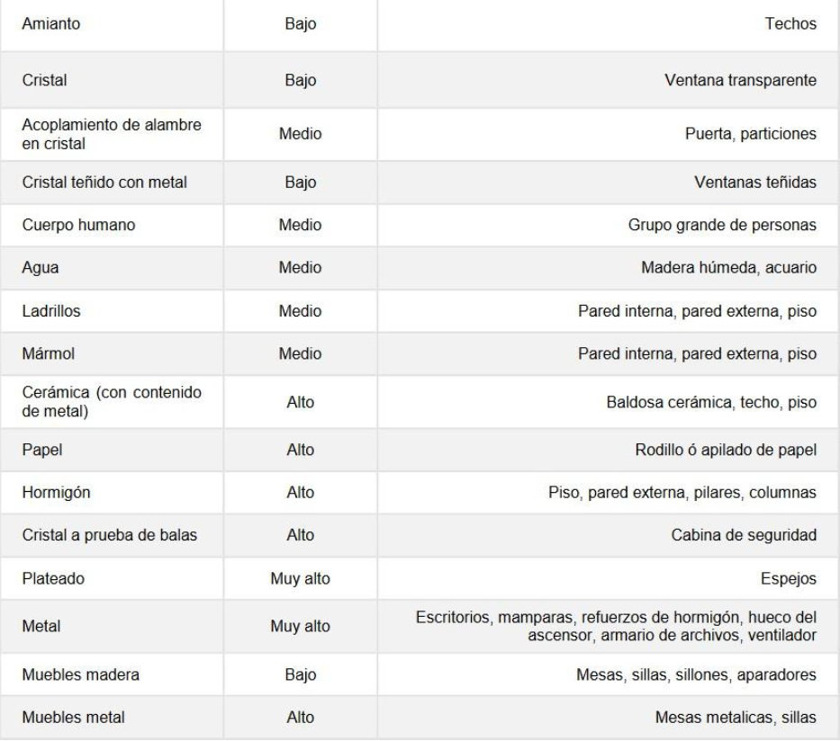

# ESPECIFICACIONES TÉCNICAS Y ALCANCE DE SERVICIO - METRO WIFI – WIFI ADMINISTRADO

## 1. DESCRIPCIÓN GENERAL

El servicio MetroWiFI es un servicio de interconexión inalámbrica de dispositivos (WiFi) que cuenta con la posibilidad de realizar monitoreos y controles desde una plataforma central. El servicio permite el acceso inalámbrico a la red Internet (servicio no incluido) y a la conexión entre equipos situados dentro del mismo Cliente, entendiéndose por un mismo ambiente que se encuentra delimitado dentro del plano de un mismo piso. Esto se realiza mediante el uso de un punto de acceso WiFi (AP) al cual se pueden conectar distintos dispositivos, entre ellos, PCs, Notebooks, Smartphones, SmartTV u otros en forma inalámbrica, siempre que las mismas tengan el software y hardware adecuado para acceder a redes WiFi. Resulta posible conectar otros pisos o inclusive otras ubicaciones agregando equipos similares a la solución (AP’s).

## 2. ALCANCE Y ESPECIFICACIÓN TÉCNICA

Los equipos incluidos en la solución soportan Normas 802.11 A, B, G, N, AC y AX, hasta 16 SSID por equipo o clúster, Roaming dinámico, Beamforming, MU-MIMO, ZTP, Monitoreo y control desde la plataforma Aruba Central,(El servicio no será monitoreado por Metrotel ni su NOC) esta plataforma incluye controles de contenido, filtros de url por reputación o tipo, informes de consumo y salud de la red, control de los equipos de la red, salud del equipamiento, gestión de clientes de la red, portal cautivo guest, Aplicaciones de seguridad y auditoria de red.
El servicio Metrotel WIFI Administrado se presenta en dos modalidades, Básica y Premium, en función de las necesidades del cliente, el área a cubrir, la densidad de conexión y los servicios incluidos.
En ambos casos se utilizan equipos de la marca Aruba HPE con alimentación PoE, administración avanzada cloud del portal Aruba Central y todas sus funciones. Esto permite la escalabilidad del servicio, pudiendo incrementar área de cobertura, densidad, o sitios, si necesidad de cambiar hardware, manteniendo las configuraciones existentes y el mismo portal de administración.

**Opcional equipo**

**AP Aruba 303 o similar:** Es un IAP del tipo Indoor y de características Premium. Los mismos trabajan con especificaciones ambientales de Temperatura: 0° C a +50° C (+32° F a +122° F)- Humedad: Del 5 % al 93 % sin condensación.

**Opcional Kit de instalación**
+ **Un inyector PoE Aruba HPE:** cables Ethernet y Manuales, el servicio se orienta a una mediana o pequeña oficina.
+ **Switch PoE no administrable Aruba HPE:** Este servicio puede ser instalado y configurado por el cliente, con el manual de instalación y ayuda del soporte Metrotel o si lo considera necesario. El SW no posee administración alguna y solo pueden conectarse hasta 3 APs en un mismo equipo.
+ **Switch PoE administrables Aruba HPE:** Este servicio es instalado y configurado por Metrotel, previa coordinación con el cliente, así mismo el cliente puede administrar el servicio o solicitar el soporte del NOC Metrotel. El SW posee administración el cual puede gestionarse desde Aruba Central y solo pueden conectarse hasta 7 APs en un mismo equipo.
  
Los dispositivos que el Cliente desee conectar al WiFi deberán tener hardware y software que soporte el estándar 802.11 b/g/n/ac. Para hacer uso de este servicio deberá tener contratado un servicio de Internet de Metrotel.

Para la instalación del servicio, la red debe contar con un CPE que brinde servicio DHCP y GW para las funciones ZTP.

Los equipos cuentan con radios de 2.4GHZ y 5GHZ, un máximo de 256 clientes asociados por clúster y 16 SSID por clúster, estos números representan valores máximos de tabla y estarán sujetos a tecnología de cada dispositivo cliente, consumo de cada cliente y factores ambientales de ruido e interferencia de banda.

El soporte técnico contemplado con el Servicio alcanza al equipamiento provisto por Metrotel. El mismo contempla resolución de problemas de configuración y problemas propios, llegando incluso hasta el recambio del equipo en caso de fallas de hardware. Si el equipo fue instalado en por el cliente o alguien por el designado, a más de 3 metros de altura o en cualquier tipo de sitio que no sea de acceso directo, el equipo deberá ser entregado al personal de Metrotel o quien Metrotel designe en su nombre, en mano, sin ser responsabilidad de Metrotel desinstalar el equipamiento. El soporte no cubre problemas de conectividad en la red interna del Cliente.

Es importante destacar que Metrotel no puede asegurar el alcance y la performance de la conectividad en todo el sitio. La cobertura puede sufrir modificaciones ante cambios en las condiciones edilicias y o mobiliarias, dado que puede atenuarse el nivel de señal, lo que implica una posible reducción del área de cobertura como de la velocidad alcanzada por los diferentes dispositivos conectados. La distancia del equipo a la antena también es factor de reducción de velocidad. En todo WIFI la distancia a la antena disminuye la velocidad de transferencia.

## 3. SOPORTE TÉCNICO

Ubicado físicamente en la ciudad de Buenos Aires, el servicio de soporte técnico de Metrotel funciona las 24 horas del día, los 365 días del año. Para acceder al mismo, el cliente dispone de un número gratuito de contacto (0800-362-1040) mediante el cual podrá realizar la gestión de eventuales reclamos. Desde la Mesa de Ayuda se realiza el diagnóstico para aislar la falla. Una vez identificada la misma, se procederá a realizar su resolución. El cliente será informado, ya sea por teléfono y/o mail, del estado y avance de la falla en particular, durante la existencia de la misma. Si la falla es provocada por hardware y el mismo debe ser reemplazado, el mismo será reemplazado dentro de las 48hs de identificado el inconveniente.

El servicio Básico de soporte incluye 3 consultas telefónicas o vía correo electrónico para solicitar modificaciones de SSID u otras y o asesoramiento sobre el servicio, estas consultas no son acumulativas o combinables con los pedidos de soporte técnico por fallas. Los pedidos de soporte que resulten una falla por configuraciones aplicadas estarán sujetos a facturación. El servicio Premium no prevé límite de consultas o soporte.

## 4. MANTENIMIENTO PROGRAMADO

El mantenimiento programado consistirá en toda intervención realizada en la red de Metrotel, la cual será notificada previamente (con más de 48 horas de anticipación) al cliente y se realizará dentro del horario de mantenimiento establecido. Si el horario del corte previsto afecta la labor del cliente, éste puede solicitar la modificación del mismo. Metrotel se compromete a realizar los máximos esfuerzos para mover el corte al nuevo horario solicitado. Este tipo de interrupciones se puede realizar para reemplazar o agregar elementos a la red a fin de ampliar y mejorar permanentemente el servicio.

## 5. INSTALACIÓN, PUESTA EN MARCHA Y CONFIGURACIÓN INICIAL

Para los servicios autoinstalables, el cliente definirá la ubicación de el / los equipos, siguiendo la guía de instalación. El servicio cuenta con una configuración básica, la misma podrá ser modificada o no por el cliente.

En caso de que la provisión del Servicio contratado requiera una instalación física en el domicilio del Cliente, éste se compromete a estar presente durante la instalación o bien designar fehacientemente a una persona mayor de edad y debidamente identificada, que actúe en su representación.

El Servicio prevé una instalación básica con cable UTP estándar que incluye la conexión de los IAP y sus configuraciones, cuenta con un cableado lineal de hasta 50mts. Los IAP no se instalarán a más de 3 mts. de altura No se incluye energía, cable canal, bandejas ni tampoco realizar perforaciones u otro tipo de instalación física.

La puesta en marcha del Servicio será realizada por el personal de Metrotel o terceros que actuarán en nombre de Metrotel, quienes realizarán las tareas de instalación y solicitarán al Cliente o a la persona por él autorizada, el conforme vía la firma del Formulario de Aceptación de Servicios y el Formulario de entrega en Comodato de Equipos. La firma de dichos formularios por parte del Cliente y/o de la persona por él designada para estar presente al momento de la instalación, implica la conformidad del Cliente respecto de la instalación y de la capacidad de utilizar el servicio en cuestión, así como del carácter en que se entregan los equipos al Cliente, quien será responsable de éstos con el compromiso de devolverlos en buen estado de conservación y mantenimiento a la finalización de la prestación del servicio.

Para la instalación, el técnico recomendará la mejor ubicación para los AP, probará el nivel de señal desde su dispositivo. Si el Cliente dispone de una Notebook con soporte WiFi, le podrá dejar el servicio configurado allí. Con esto quedará finalizada la prueba de conectividad y la instalación.

El servicio Metrotel WIFI Administrado, cuenta con una configuración inicial que permite su funcionamiento, la misma puede ser modificada por el usuario. La configuración incluye:
+ Compatibilidad WIFI 802.11 a, b, g, n, ac. 2 SSID (redes WIFI) 1 red para el cliente y una red guest para invitados, esta red guest cuenta con un portal cautivo que permite al invitado conectarse a una red totalmente separada de la red del cliente sin que el invitado conozca ni la red, ni el password ni la topología de la red del cliente. El portal incluido es genérico.
+ Las redes tendrán nombres genéricos, pudiendo el cliente modificar dichos nombres
+ El servicio escala hasta 3 SSID (3 Redes WIFI) incluidas, pudiendo llegar a 16 SSID en total.
+ Las redes tendrán nombres genéricos, pudiendo el cliente modificar dichos nombres. LA seguridad de la red del cliente estará definida con password.
+ 1 VLAN, pudiendo agregar hasta 3 Vlan. Red 2.4Ghz y Red 5.8Ghz en el mismo SSID con asignación dinámica.
+ Roaming automático habilitado, con asignación dinámica de AP y de Red.
+ Priorización de tráfico RTP (real time protocol) para mejorar las comunicaciones de voz.
+ Analítica de red WIFI incluida en el dashboard del servicio.

## 6. RESPONSABILIDADES DEL CLIENTE

Para poder utilizar el servicio WiFi, el Cliente deberá contar con dispositivos que soporten el estándar WiFi 802.11 b/g/n/ac. La configuración de la conexión WiFi en los distintos dispositivos es responsabilidad del propio Cliente.

El cliente deberá, de ser necesario, tender cable canal, bandejas porta cables, toma corrientes, mordazas y grampas, que completen el cableado interno de su red, asimismo si el cableado requiere acceso a lugares comunes del edificio, las llaves y permisos necesarios; si requiere acceso a lugares cerrados o de difícil acceso, todos los medios preparados y coordinados e informados con anticipación, para poder llevar acabo la instalación del servicio con normalidad y en los plazos previstos. Si el cliente desea el uso de otro cable que no sea UTP Estándar, deberá proveerlo en la cantidad de metros necesarios.

Si el uso del servicio lo requiere, el cliente será responsable de la alimentación eléctrica de respaldo (UPS, Baterías), reconociendo que no es responsabilidad de Metrotel el funcionamiento del servicio ante un corte de la red eléctrica. Es responsabilidad del cliente asegurar la alimentación eléctrica correcta y la protección de sobrecargas.

En los servicios auto instalados el Cliente será responsable de conocer las “Recomendaciones para ubicar un punto de acceso WiFi”, anexas al presente.

## 7. LIMITACIÓN DEL SERVICIO

El Cliente reconoce que Metrotel no puede ejercitar control sobre el contenido de la información que circula a través de la red inalámbrica y/o de Internet. Por lo tanto, Metrotel NO es responsable del contenido de ningún mensaje y/o información tanto si el envío fue hecho o no por un Cliente de Metrotel.

La seguridad informática en los equipos del Cliente contra intrusos, virus, hackers, etc., es exclusiva responsabilidad del propio Cliente. Si bien el servicio cuenta con filtros de puertos, contenidos y páginas, Metrotel recomienda la implementación del servicio SECURITY PACK si la sensibilidad de la información a traficar lo amerita.

El resguardo de la información en los equipos / sistemas del Cliente queda bajo su exclusiva responsabilidad. Metrotel recomienda el uso de backups cloud para el respaldo de la información almacenada en los equipos y sistemas del Cliente.
Queda establecido que los anchos de banda alcanzados por los dispositivos no serán los del enlace físico y estarán sujetos a:
+ Norma 802.11 que utilice el equipo ( también llamadas WIFI 2, 3, 4, 5, 6) dejando como ejemplo 802.11 g o WIFI 3 es una norma que solo trabaja en la banca 2.4GHZ y podría alcanzar como máximo 54mbit/s Si el equipo trabaja en la norma 802.11 ac (también llamada WIFI 5) el equipo podría alcanzar velocidades entre 150 y 600 mbits/s sujeto a muchos otros factores ajenos al ancho de banda del enlace.
+ Banda de Radio a la que esté conectado: Un equipo conectado a la banda 2.4GHZ podría tener una mayor interferencia, lo que perjudicaría la velocidad máxima alcanzada, pero esta banda tiene una mayor cobertura.
+ Distancia de la antena, cuanto más lejos de la antena esta un equipo conectado, menor va a ser la velocidad alcanzada.
+ Cantidad de equipos conectados, la velocidad del enlace físico será compartida por los equipos conectados la red WIFI.
+ Interferencia, No solo otros equipos transmitiendo son interferencia, un armario de chapa o una pared lo son y la velocidad estará afectada directamente por estos factores.

## 8. INSTALACIÓN

**Recomendaciones para ubicar un punto de acceso WiFi**

Uno de los factores principales que determinan el éxito en el despliegue de una red inalámbrica es dónde se sitúa el equipo inalámbrico.

Para conseguir una adecuada instalación, ofreciendo una óptima cobertura inalámbrica, se debe analizar con detalle el lugar a cubrir y los obstáculos a evitar.

En primer lugar, se debe conocer qué cobertura se desea ofrecer. El alcance de la señal WiFi depende de la potencia del AP, la potencia del dispositivo WiFi con la que se va a conectar el usuario y los obstáculos que la señal tenga que atravesar.

Siendo que la potencia del AP es fija, el alcance de la red WiFi depende de los dispositivos terminales del Cliente y de los objetos / estructura del inmueble. La velocidad de la conexión depende directamente de la distancia existente entre el AP y el Cliente conectado.

Para lograr alcanzar la velocidad máxima por un único dispositivo, más allá de lo mencionado en el párrafo anterior, se debe tener presente que el mismo debe soportar la "norma WIFI ac como mínimo". Esto no invalida que muchos dispositivos con una norma inferior alcancen de manera simultánea la velocidad total del equipo (suma de velocidades de cada dispositivo).

El equipo que se entrega en servicio posee antenas internas, las cuales ofrecen un círculo de cobertura alrededor del equipo.

Es importante tener en cuenta que justo debajo de la antena la cobertura obtenida es pequeña. Las señales de radio se propagan hacia fuera de la antena de una manera circular, a menos que se encuentre con paredes, puertas, vidrios, etc. que pueden obstruir la propagación de la señal. En este caso la señal seguramente pueda continuar, pero no con suficiente energía como para ofrecer un rendimiento en largas distancias.

A continuación, se exponen algunos conceptos para tener en cuenta a la hora de decidir dónde situar el AP, para ofrecer una buena cobertura:

Si se desea obtener una cobertura global del lugar, el AP se debe situar en el centro del mismo, ya que la cobertura ofrecida es circular.

Si se desea obtener cobertura en lugares estratégicos (determinados lugares) es necesario realizar un estudio de dónde ubicar el AP.

Como la señal se refleja de forma similar al sonido, se puede pensar desde qué punto del ambiente se reparte mejor la voz llegando a recibirse adecuadamente en el lugar al que se quiere cubrir.

Si, a pesar de cumplir con estos conceptos, no se consigue obtener una buena señal, es necesario agregar un AP Adicional.

También es importante observar los obstáculos o barreras que se pueden producir en la cobertura, estudiando los objetos que pueden absorber o reflejar la señal, llegando a degradar e incluso a bloquear la misma.

Algunos posibles obstáculos son:

**Paredes:** son un obstáculo que obviamente deberá ser evitado, disminuyendo en lo posible el número de paredes a atravesar. El yeso atenúa, pero no bloquea la señal, sin embargo, materiales de construcción más pesados, tales como muros de hormigón, pueden llegar incluso a anular totalmente la señal.

**Armarios o mobiliarios:** al igual que las paredes, el mobiliario también atenúa la señal. Es importante tener en cuenta el tipo de material de estos armarios, que pueden llegar a eliminar completamente la señal si son materiales metálicos.

**Cristal revestido:** el cristal transparente normalmente no degrada la señal. Sin embargo, puede tener un efecto perjudicial si es un cristal recubierto con una película metalizada o tiene un acoplamiento de alambre encajado en él, como puede ser un espejo, una vidriera, etc.

**Reflexión:** algunos objetos, como pueden ser las paredes, no absorben la señal, sino que la reflejan como un espejo refleja la luz.

**Interferencias o ruido:** el ruido en la señal, provocado por teléfonos inalámbricos y por otros dispositivos electrónicos, puede interferir la señal WiFi. Es aconsejable alejar el AP de equipos que necesiten una fuente de alimentación con mucho consumo y sobre todo de la caja distribuidora de energía (llaves térmicas).

**Disposición del AP:** no es aconsejable encerrar el equipo inalámbrico dentro de un mueble, ni situarlo entre objetos. Tampoco se debe situar el equipo sobre una mesa o armario metálico.

La siguiente tabla muestra el grado de atenuación producido por la absorción con materiales comunes:

**Frecuencias disponibles**

Las redes WiFi funcionan en dos frecuencias estándar para enviar y recibir datos. Estas frecuencias son 2.4 GHz y 5.0 GHz.

