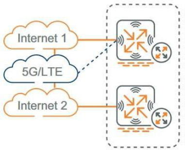
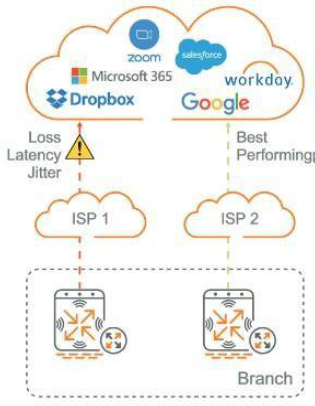
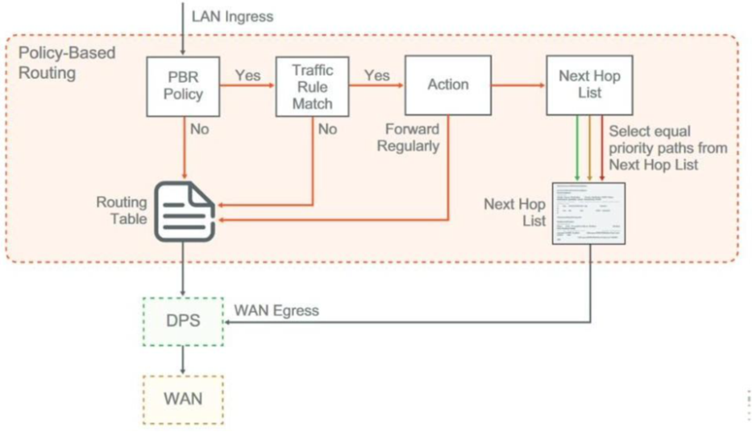
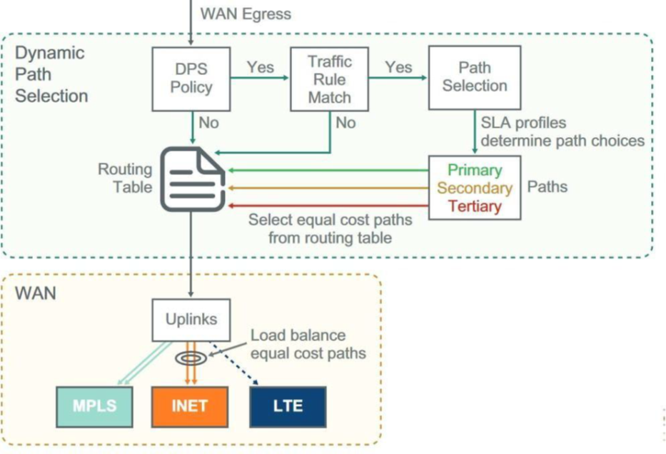

# ESPECIFICACIONES TÉCNICAS Y ALCANCE DE SERVICIO - VIRTUAL WAN

## 1. DESCRIPCIÓN GENERAL

SD-WAN de METROTEL unifica de manera centralizada todos los elementos de una red SD-WAN, implementando soluciones de Redes Definidas por Software en el ámbito de la WAN, permitiendo lograr la evolución de los servicios de conectividad privada empresarial, sumándole flexibilidad, confiabilidad y seguridad.

Metrotel incorpora el servicio SD-WAN con capacidad de control 100% en la nube y la opción de utilizar enlaces WAN por internet y/o MPLS (Multiprotocol Label Switching) de diferentes operadores, permitiendo la flexibilidad de la red WAN como así también el control y maximización del uso de los enlaces. Además, permite la visibilidad y control del tráfico de red, mejorando la experiencia del usuario y facilitando las políticas de seguridad.

Metrotel utiliza equipamiento y soluciones HPE Aruba Networking, permitiendo que el cliente controle la totalidad de los enlaces y dispositivos en forma centralizada desde el HPE Aruba Networking Central, la plataforma de gestión en la nube de Aruba, que proporciona un interfaz web sencillo para la autogestión integrada por parte del cliente de las conexiones inalámbricas, cableadas y la WAN.

Metrotel SD-WAN puede interconectar el sitio de la cabecera con otras ubicaciones remotas, lo que lo convierte en una parte fundamental de la red. Metrotel SD-WAN permite que una organización implemente la opción más eficiente en cada ubicación de sucursal al brindar alternativas flexibles a las ofertas tradicionales de WAN privadas. Resulta posible elegir diferentes transportes WAN sin preocuparse por los cambios en la dirección IP. Asimismo, el tráfico puede usar todo el ancho de banda disponible mientras mantiene los TMR definidos por el administrador de red en Central.*

*El cliente deberá autogestionar el servicio y definir las políticas de ruteo de acuerdo a sus necesidades, utilizando las funcionalidades de la HPE Aruba Networking Central

## 2. ESPECIFICACIONES TÉCNICAS

**Equipamiento**

Los equipos incluidos en el servicio Metrotel SD-WAN son los siguientes: Gateway 7030 y 9004 LTE, o similar de idénticas o mejores prestaciones, todos controlados y orquestados desde el portal cloud que correspondiere y en todos los casos con las suscripciones al portal y las funcionalidades de routing incluidas.

*Metrotel se reserva el derecho de utilizar estos equipos u otros de idénticas o mejores características de acuerdo con su criterio y con las mejores prácticas para el diseño del servicio.*

El servicio contempla la configuración básica del equipo con sus licencias, y hasta 3 metros de cable utp por gateway. No se incluye cableado de energía, ni movimientos de mobiliario alguno. No está incluido el rack, ni ups, ni estabilizadores de tensión.

## 3. PUESTA EN MARCHA DEL SERVICIO

**Recepción de datos y coordinación:**

Se establecerá un único punto de contacto mediante una casilla de correo y un número telefónico para la coordinación de las etapas y accesos a los sitios. En esta instancia se colectará toda la información y se definirá la configuración inicial, a partir de la cual el Cliente podrá luego realizar las modificaciones que requiera utilizando las herramientas de autogestión disponibles en la HPE Aruba Networking Central.

**Asignación de licencias**

Dado que el servicio funciona con un portal cloud y que este requiere que el hardware sea registrado y asignado al cliente, METROTEL asociará las licencias al hardware y asignará el hardware al cliente. La licencia estándar provista es: Aruba Foundation se pueden ver sus características en el siguiente enlace,( [About Aruba Central Licenses (arubanetworks.com)](https://arubanetworking.hpe.com/techdocs/central/2.5.6/content/nms/subscriptions/overview-licensing.htm) ), en la columna nomenclada “Foundation Licence Features”.

**Despacho y seguimiento**

Previamente a proceder con el despacho y seguimiento de la solicitud de nueva instalación se realizará una confirmación de la cita con el cliente para asegurarse que el cliente esté presente y garantice los accesos necesarios en el sitio de instalación.

Realizado el punto anterior, se procederá al despacho y asignación del técnico que asistirá al domicilio del sitio.

**Instalación en sitio**

Las tareas comprenden únicamente la entrega del equipo en el domicilio del cliente, y la conexión de este a la energía e internet provistos por el cliente El sitio debe contar con una instalación eléctrica accesible y al menos un servicio de conectividad para poder realizar las pruebas y finalizar el proceso de instalación. Cualquier otra tarea que no sea las antes mencionadas están fuera del alcance, con esto nos referimos a cableado interno, suministro de energía estabilizada, puesta a tierra o cualquier otra tarea que se requiera para adecuar la sala técnica.

En caso de que el técnico se presente en el domicilio del cliente y no pudiere realizar la instalación por razones ajenas a Metrotel, podrá facturar la visita y se reprogramara una nueva visita.

**Configuración inicial comprometida por metrotel**

El servicio se considera SD-WAN cuando se provee la interconexión de 2 o más puntos con gateways controlados por la Plataforma.

El servicio se considera SD-Branch(*1) cuando, al menos en un punto, se provee el servicio de interconexión con Gateway y el networking de la sucursal, wired e incluyendo Metro-WIFI(*1) dentro del mismo servicio controlado por central.

Los servicios SD-WAN estarán en la misma cuenta y el mismo tenant de la solución MetroWIFI(*1) y se gestionarán con el mismo usuario.

No se considera SD-Branch(*1) si el punto que tiene red no está conectado por gateways. No se considera SD-WAN si la solución tiene dos o más sucursales con Metro-WIFI pero no están conectadas por gateways.

                        SD-WAN                                        SD-BRANCH

                

  
  

**Proceso de aprovisionamiento del servicio**

Se creará un tenant en HPE Aruba Networking Central, el mismo tendrá cargados los equipos que se asignaron al cliente y las funciones incluidas en la licencia Foundation. En este mismo tenant se creará un usuario administrador con una dirección de correo electrónico que proveerá el cliente, a esa dirección llegará la invitación para crear el nuevo usuario administrador del tenant, siendo ese usuario de uso exclusivo del cliente. Con este usuario el cliente podrá crear nuevos usuarios con perfil de administrador, operador o solo lectura para administrar o tercerizar si así lo considera, la administración del servicio.

Metrotel no tiene responsabilidad alguna sobre las modificaciones que se realicen con esos usuarios ni de la seguridad de las cuentas creadas por el cliente.

Para SD-WAN Se deben distinguir dos conceptos relacionados con las redes:

1. **Underlay:** es la red tradicional, la red física, medio de transporte propio de los operadores.
2. **Overlay:** es la red virtual que se crea sobre la red física, es la red programable, la red propia de los clientes.

(*1) *Servicios no incluidos, se pueden contratar por separado*

**Underlay:**

Enlaces de datos, MPLS o Internet, propios y de terceros en cada una de las sucursales, estos enlaces pueden ser dedicados de fibra, HFC, FTTX, ADSL, 4G(*2) o Satelital.

Cada sucursal o Campus unido a la red deberá contar con al menos un enlace de datos WAN, siendo ideal 2 enlaces WAN, se podrá usar como ruta el 4G(*2), siendo poco recomendable para único enlace de una sucursal.

El underlay de la solución estará compuesto por la totalidad de enlaces que conformen la solución, sin responsabilidad de Metrotel sobre los enlaces que no sean provistos por Metrotel. Se recomienda una arquitectura de tipo Hub and Spoke.

Se considera Activo el underlay cuando un equipo tiene al menos un enlace activo en WAN, en este punto, los túneles de las sucursales están activos contra el hub de la solución, cada WAN declarada, que no tenga un enlace activo, tendrá en consecuencia un túnel inactivo, esto genera una alarma que no se podrá considerar como falla del servicio, aplicándose la falla solo al enlace WAN que no esté activo.

**Configuración del Underlay:**

Definición de UPLINKS, una o más bocas se definirán como uplink y se le asignara una vlan, de no informar el cliente una necesidad especifica, se asignan la boca 2 y 3 del GW y se asigna la vlan 4085 y 4086 respectivamente, definiendo ambos uplink con el mismo peso y sin compresión.

Ambas bocas quedan configuradas en Access y la vlan solo formara parte del underlay de cada sucursal sin ser publicada a otras sucursales .

Interfaz: Se crearán las interfaces LAN y WAN, de no existir una especificación del cliente, se configuran de la siguiente manera: Bocas 0 y 1 LAN, en cada boca las VLAN 101 y 102 respectivamente, si no se especifica rango de red o DHCP Activo, se dejan en acces sin servicios y como cliente DHCP, si se solicita configuración, se aplicara 1 vlan por puerto, pudiendo definir un DHCP por vlan con un rango ip para cada dhcp, para cada vlan.

Bocas 2 y 3 como WAN, en estas bocas se cargarán las vlan 4085 y 4086, en ambos casos se asignarán los valores IP de cada servicio WAN, pudiendo ser ip fija o DHCP.

De utilizarse direcciones ip estáticas en una o más WAN, se definirán las puertas de enlace estáticas en la sección routing.

No está incluida otra configuración del underlay.

(*2) *Servicios no provistos por Metrotel*

**Configuración del Overlay:**

Se configura el overlay de manera orquestada por el HUB, un equipo será HUB de la red y manejará los túneles de las sucursales o branches No está contemplada la configuración de túneles tipo site to site.

**Policy based routing:** No se definirán ruteos basados en políticas, si el cliente lo solicitara, se definirán como máximo 3 políticas que podrán ser basadas en servicio, protocolo, categoría o web reputación.

**Dynamic Path Steering:** se dejará configurada una política básica de path por link activo Routing: No se configuran protocolos de ruteo tipo BGP, OSPF o RIP, si bien están disponibles no estarán incluidos en las configuraciones básicas.

**Overlay Routing:** No se definirá routing redistribuido por default, solo si el cliente solicita redistribución de rutas se configuraran en el overlay un máximo de 2 por sucursal. Seguridad: No se configurarán reglas ni políticas de filtrado.

No está incluida otra configuración en el Overlay

**Limitaciones:**
El servicio incluye la totalidad de features de HPE Aruba Networking Central con licencia Foundation

## 4. CONFORMIDAD DEL CLIENTE

La provisión del servicio Metrotel SD-WAN requiere una instalación física en el/los domicilios del cliente, y la misma será realizada por el personal de Metrotel o terceros que actuarán en nombre de Metrotel, quienes dejarán el servicio en condiciones de ser prestado y solicitarán al cliente el conforme correspondiente mediante la firma del Formulario “Informe de Instalación de Cliente”. Previamente, el personal de Metrotel ejecutará las siguientes pruebas básicas con el fin de poder certificar el correcto funcionamiento:

+ Se controla que los Gateways se encuentren activos en Aruba Central, en el apartado Devices→Gateways
+ Se comprueba que en el menú Overview→Routing, las rutas están ativas
  
**La firma de dicho formulario asume la conformidad del cliente respecto de la instalación y de la capacidad de utilizar el servicio en cuestión.**

## 5. RESPONSABILIDADES DEL CLIENTE

El servicio SD-WAN de Metrotel está diseñado para ser totalmente autogestionado por el cliente en lo que respecta a configuraciones y facilidades previstas de acuerdo al alcance de la licencia Foundation. ( [About Aruba Central Licenses (arubanetworks.com)](https://arubanetworking.hpe.com/techdocs/central/2.5.6/content/nms/subscriptions/overview-licensing.htm) )

El cliente podrá a través del portal de autogestión HPE Aruba Networking Central configurar y disponibilizar las funciones incluidas en la licencia Aruba Foundation. Metrotel limita la instalación y las configuraciones de acuerdo a lo detallado en el apartado “Configuración Inicial comprometida por Metrotel”.

Cualquier configuración que el cliente quiera realizar y exceda lo mencionado en el apartado “Configuración Inicial comprometida por Metrotel”, se consideraran modificaciones y se cotizaran por separado como horas de servicios profesionales por parte de Metrotel. El Cliente puede también optar por realizar sus propias configuraciones o contratar a un tercero para que ejecute las mismas.

Cualquier inconveniente que sea producto de las configuraciones que no sean realizadas por Metrotel luego de la entrega del servicio, estarán por fuera del Alcance y en caso de requerir soporte para volver a configurar el servicio tendrá un costo adicional en concepto de servicios profesionales.

El Servicio Metrotel SD-WAN incluye aspectos avanzados de seguridad, que podrán ser configuradas por el cliente, estando bajo su responsabilidad generar, configurar y supervisar sus propias reglas.
Para una correcta instalación del servicio, el cliente deberá tener en cuenta lo solicitado a continuación:

**Instalación en domicilio del cliente:** El cableado de red desde el sitio debe ser categoría 5 ó superior.

Deben existir tomacorrientes para PCs, monitores y cualquier otro dispositivo electrónico, incluyendo un tomacorriente disponible donde se instalará el equipo provisto por Metrotel.
El Cliente autoriza al personal técnico de Metrotel, en caso de ser necesario, a realizar las instalaciones necesarias en la computadora personal u otro dispositivo con acceso a Internet ubicado en el domicilio donde se solicita el servicio, esto es a los efectos de permitir la conexión con la red y la provisión del servicio. En tal caso, el Cliente se compromete a estar presente durante la instalación, la cual tendrá lugar en fecha y horario a convenir entre las partes y a suscribir en dicho acto el correspondiente informe de instalación y /o recepción en comodato de los equipos.

Cuando Metrotel concurra al domicilio del Cliente con la finalidad de realizar la instalación del servicio, si el Cliente no tuviese computadora persona u otros dispositivos en su poder y disponibles para realizar las pruebas de conexión, Metrotel realizará la verificación con un equipo de su propiedad que utilizará al solo efecto de realizar dicha prueba, y en caso de obtener un resultado positivo se considerará entregado a partir de dicho momento.

El Cliente reconoce y acepta que dependiendo de las características del servicio y del tipo de inmueble en el cual haya que realizar la instalación, la misma podrá estar sujeta a la obtención de autorizaciones, siendo éstas responsabilidad del Cliente.
Los Equipos instalados deberán ser destinados exclusivamente a su utilización para servicios prestados por Metrotel, y su uso estará permitido solamente al Cliente, no pudiendo ser entregados o transferidos a terceros bajo ningún título o circunstancia, aunque fuera accidental o temporariamente. El Cliente no podrá dar a los Equipos un uso distinto que el señalado en el presente. En caso contrario, Metrotel podrá: a) Exigir la restitución inmediata de los mismos, y la reparación de los perjuicios que se le hubiesen causado, o b) De no reunirse lo expuesto en a), proceder a la facturación de los Equipos a nombre del Cliente, a su valor de mercado.
Los Equipos serán instalados y deberán permanecer bajo la guarda del Cliente en el domicilio de su instalación. Tal ubicación sólo se modificará con la debida autorización previa y por escrito de Metrotel.
La puesta a tierra de los Equipos deberá estar en concordancia con las reglamentaciones eléctricas locales. En caso de incumplimiento por parte del Cliente, será de aplicación lo dispuesto por los artículos 513 in fine y 2268 del Código Civil.

El Cliente será responsable ante Metrotel por todo acto propio o de terceros que pueda afectar de algún modo la situación de hecho y/o de derecho de los Equipos. El Cliente permitirá que Metrotel inserte en los Equipos las marcas e identificaciones que sean necesarias para que su carácter de propietario de los mismos aparezca manifiesto, identificaciones que deberán ser conservadas en forma permanente durante la vigencia del Comodato y en modo alguno pueden ser tapadas o dificultarse su lectura. Asimismo, el Cliente deberá abstenerse de agregar inscripciones de cualquier tipo sobre los equipos.

El Cliente será responsable por los desperfectos técnicos y roturas que puedan sufrir los Equipos, siempre que no se sigan del uso normal de los mismos, razón por la cual afrontará en tales casos el costo de su reparación de acuerdo con el dictamen técnico que a tal efecto emita Metrotel, quien podrá exigir el importe equivalente al 100% de los cargos incurridos.

El Cliente deberá hacerse cargo de todos los gastos que le demande la conservación en buen estado de los equipos.

Metrotel queda exonerada de toda responsabilidad frente a cualquier daño que pudiera sufrir el Cliente, sus dependientes y/o terceros vinculados a o derivado del deterioro y/o uso inapropiado de los Equipos siempre que la causa no fuera imputable en forma directa a Metrotel.

En consecuencia, el Cliente se obliga a mantener indemne a Metrotel, frente a cualquier reclamo y/o demanda y/o sanción que pudiera tener lugar, por los daños referidos en el párrafo precedente.

## 6. LIMITACIONES DEL SERVICIO

La seguridad informática en los equipos del cliente contra intrusos, virus, hackers, etc., es exclusiva responsabilidad del propio cliente. Metrotel recomienda el uso de programas Antivirus, Firewalls y cualquier software o hardware vigente y actualizado que evite estos ataques.

El resguardo de la información en los equipos / sistemas del cliente queda bajo su exclusiva responsabilidad. Metrotel recomienda el uso de software o hardware para resguardo y respaldo de la información almacenada en los equipos y sistemas del cliente.

Las políticas aplicadas en ruteo y calidad de servicio serán totalmente válidas dentro de la red de Metrotel. En caso de que el cliente integre uno o más puntos de su red IP a través de terceros contratados por el cliente, Metrotel no podrá garantizar que el tráfico sea tratado del mismo modo que dentro de su red. Es por esto que las redes integradas por terceros no estarán sujetas a las mediciones de disponibilidad ni de alcance reduciendo su funcionamiento al “mejor esfuerzo”.

Metrotel no es responsable de las conexiones de internet, transporte de datos, enrutamientos, servicios 4G, LTE contratados por el cliente para el correcto funcionamiento del servicio SD-WAN Metrotel.

## 7. CENTRO DE ATENCIÓN Y SOPORTE TÉCNICO

Ubicado físicamente en la ciudad de Buenos Aires, el servicio de soporte técnico de Metrotel funciona las 24 horas del día, los 365 días del año. Para acceder al mismo, el cliente dispone de un número gratuito de contacto (0800-362-1040) mediante el cual podrá realizar la gestión de eventuales reclamos. Desde la Mesa de Ayuda se realiza el diagnóstico para aislar la falla. Una vez identificada la misma, se procederá a realizar su inmediata resolución. El cliente será informado, ya sea por teléfono y/o mail, del estado y avance de la falla en particular, durante la existencia de esta.

Antes de generar un reclamo el cliente deberá verificar sus conexiones, las modificaciones recientes en las configuraciones, provisión de energía en todos sus equipos, accesibilidad a HPE Aruba Networking Central.

Con la apertura del ticket de reclamo, el soporte técnico de Metrotel ingresará a la plataforma HPE Aruba Networking Central a fin de diagnosticar y evaluar soluciones al problema. En caso de no lograr una solución o determinar la existencia de una falla física se coordinará enviar personal al sitio.

Si por razones ajenas a Metrotel, el técnico se hiciere presente en el sitio y no pudiere ingresar y/o tener acceso al equipamiento, o bien, la falla no fuere responsabilidad de Metrotel(falta de energía, conectividad o daños inferidos en el equipamiento por mal uso o exposición a factores que están fuera del uso normal), el costo de la visita técnica será facturada como “visita no efectiva”, por un valor de U$D 250 + IVA, como así también se facturará el equipamiento dañado si lo requiriese el servicio su restauración.

## 8. TIEMPO MÁXIMO DE RESTAURACIÓN

El tiempo de restauración es el tiempo transcurrido entre la hora de apertura de ticket por la detección del problema (Por parte de Metrotel o bien a través de la notificación del cliente al área de Servicio de Atención al Cliente) y la hora de restablecimiento del servicio.

El servicio cuenta con un Tiempo máximo de restauración, según corresponda.

1. Por inconvenientes en HPE Aruba Networking Central, Según la siguiente tabla:

2. Por inconvenientes en sitio de cliente dentro de AMBA(*3), TMR 48 horas.
3. Por inconvenientes en sitio de cliente en resto del País, TMR 72 horas.
Superados estos plazos, comenzara a aplicar las siguientes penalidades:

**Soporte HPE Aruba Networking Central**

**Soporte en sitio**

El abono sobre el cual se aplican las penalidades corresponde a los sitios afectados únicamente.

(*3) *El AMBA (Área Metropolitana de Buenos Aires) es la zona urbana que se extiende desde Campana hasta La Plata, con límite físico en el Río de la Plata e imaginario en la Ruta Provincial 6.*

## 8. BAJA DEL SERVICIO

Al producirse la baja del servicio SD-WAN, fuere por finalización del contrato o cualquier otra causa, el cliente entregara en las oficinas de Metrotel, en persona o por correo, la totalidad del equipamiento entregado por Metrotel en comodato al momento de la instalación, incluyendo fuentes de alimentación y cables, Reservándose Metrotel el derecho a facturar las diferencias de inventario, fuere por faltante como por daños ajenos al uso normal del equipamiento.

## 9. CASOS DE MANTENIMIENTO Y/O CONSULTA

Los tickets que incluyan modificaciones en el servicio que no sean por fallas de este, son considerados mantenimientos del servicio, toda modificación de redes, rutas, filtros, accesos, nombres, valores de SLA de accesos y toda otra modificación que se encuentre disponible en la plataforma cloud, están dentro de la categoría mantenimiento. Todos los tickets que incluyan consultas sobre el uso de la plataforma cloud, asistencia para modificaciones, conexiones y toda otra asistencia está dentro de la categoría consulta. Todas las configuraciones del servicio y los reportes estarán disponibles sin limitaciones en la plataforma cloud del servicio con el usuario que se asigne al cliente.

## 10. MANTENIMIENTO PROGRAMADO

El mantenimiento programado consistirá en toda intervención realizada en la red de Metrotel, la cual será notificada previamente (con al menos 48 horas de anticipación) al cliente y se realizará dentro del horario de mantenimiento establecido. Este tipo de interrupciones se puede realizar para reemplazar o modificar elementos a la red y/o plataformas a fin de ampliar y mejorar permanentemente el servicio.

## 11. CASOS DE USO RECOMENDADOS (NO FORMA PARTE DEL ALCANCE DE SERVICIO)

**Implementaciones de Sucursales**

La mayoría de las organizaciones implementan SD-WAN con dos interfaces WAN en gateways de una o dos sucursales, según la importancia comercial de la ubicación.

Cada rama admite hasta tres interfaces WAN activas y una de backup. Las interfaces WAN pueden ser enlaces públicos o privados, dependiendo de lo que esté disponible en diferentes áreas del país. El objetivo de todos los diseños de SD-WAN es elegir la mejor ruta WAN para cada clase de tráfico. Después de elegir la mejor ruta en función de las condiciones actuales de la WAN, las reglas flexibles permiten que su tráfico pase de manera eficiente por las rutas disponibles.

**Micro Sucursales**

Las micro sucursales utilizan un solo AP para proporcionar servicios WAN, inalámbricos y por cable a una casa u oficina pequeña. Esto permite que una organización extienda su entorno empresarial cableado e inalámbrico a los usuarios que trabajan desde casa para lograr la continuidad del negocio principal. Los túneles IPsec se organizan en Central con uno creado por nodo de clúster, lo que proporciona redundancia adicional durante las actualizaciones o interrupciones inesperadas del gateway.

Todo el tráfico puede enviarse a la ubicación de la cabecera, o el tráfico destinado a Internet puede ser fuente de NAT directamente en la micro sucursal utilizando una configuración de modo de túnel dividido simple. Las VLAN de usuario terminan en los gateways de la cabecera y el tráfico inalámbrico L2 se canaliza de forma segura a través de la WAN. El Gateway concentrador o de cabecera actúa como punto de aplicación de la política al segmentar el tráfico en la VLAN adecuada.

**Sucursales Pequeñas a Medianas:**

Las sucursales pequeñas y medianas normalmente necesitan solo un gateway de sucursal, pero también se pueden implementar en pares en ubicaciones críticas para la empresa o si se requiere capacidad de ancho de banda adicional. Se recomiendan los servicios de switching L2 debido a los requisitos limitados de funciones, lo que permite que los gateways de las sucursales brinden servicios L3 para el sitio.

Los switches tienen doble conexión a los gateways de las sucursales y tienen varias VLAN para la administración, el usuario, el IoT y la conexión inalámbrica para invitados. El diseño cableado e inalámbrico en los sitios L2 utiliza modelos de AP independientes y de dos niveles.

**Grandes Sucursales:**

Los sitios de sucursales grandes requieren dos gateways de sucursales para una mayor capacidad y redundancia de hardware.

Se requieren servicios de switching L3 debido al mayor tamaño de la red y la complejidad del direccionamiento IP.

El diseño cableado L3 sigue los mismos principios descritos en los modelos de dos y tres niveles, y el diseño inalámbrico utiliza los modelos de gateway AP y WLAN. Los gateways de las sucursales actúan como el punto de aplicación de políticas WAN, inalámbricas y cableadas para la ubicación, lo que proporciona una política de seguridad cableada e inalámbrica consistente. El uso del mismo gateway, switch, hardware inalámbrico y configuraciones de funciones reduce inversión debido a los menores costos operativos y al mantenimiento de menos juegos de repuestos. Los diseños simples y repetibles para todas sus ubicaciones le permiten configurar sus sucursales de manera idéntica, lo que reduce aún más la complejidad de la red.

El diseño de Metrotel SD-WAN proporciona una solución basada en las mejores prácticas y topologías probadas. Esto permite al administrador de la red construir una red WAN robusta que se adapte a los requisitos de la organización.

Ya sea que los usuarios se encuentren en un sitio de cabecera o en una sucursal más pequeña, este diseño proporciona un conjunto uniforme de características y funcionalidades para el acceso a la red, lo que ayuda a mejorar la satisfacción y la productividad del usuario al tiempo que reduce los costos operativos.

  
  

**Topología del servicio SD-BRANCH**

El servicio Metrotel SD-WAN podrá implementarse de diferentes maneras que combinen enlaces privados e internet o solo enlaces de internet.

**Privado + Internet**

Esta topología puede implementarse con enlaces MPLS de Metrotel, enlaces de internet de 2 o más prestadores y LTE.

Para esta configuración se puede implementar un concentrador virtual o bare metal (hardware) en el DC de Metrotel u opcionalmente en el DC del cliente y Branch gateways en las diferentes locaciones a unir en la red SD-WAN.

**Privado de varios operadores + Internet + LTE**

También puede implementarse una arquitectura Privado + internet con enlaces MPLS de diferentes operadores + enlaces de internet por LTE, para esta arquitectura el concentrador deberá estar en el DC del cliente para unir las diferentes redes MPLS.

**Internet + Internet + LTE**

  
  

Para la opción full por internet, se pueden implementar enlaces de diferentes tecnologías y operadores pensando en una red con balanceo de carga, balanceo de rutas, pero además routing estático y dinámico definido por diferentes valores de SLA.

Las opciones Dynamic Path Steering, Dynamic Path Selection, Load Balancing, Health Check entre otras, están incluidas en el servicio y agregan a la solución SD-Wan un plus en el valor agregado a su red, permitiendo un control y manejo inteligente de los enlaces contratados en la empresa, pudiendo implementarse en cualquiera de las combinaciones de enlaces.

