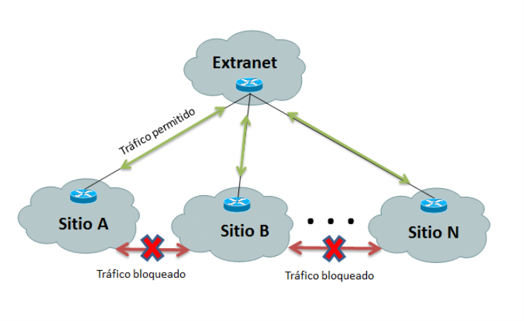
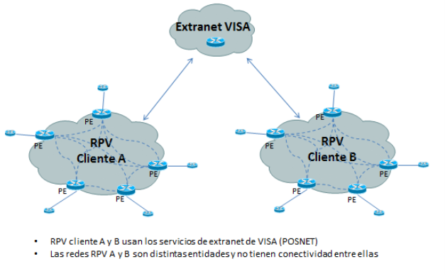

# ANEXO TÉCNICO - OPCIONAL DE SOLUCIÓN PARA EXTRANET SOBRE SERVICIO RPV

## 1. DESCRIPCIÓN GENERAL

El servicio de “Extranet” o también conocido como “servicio centralizado” o “redes Hub & Spoke” es ideal para aquellos casos en los que el cliente quiere montar un vínculo RPV (Red privada virtual) entre una o varias sucursales con un punto externo centralizador que puede ser parte de su empresa o pertenecer a otra entidad.

La topología de esta solución permite que sitios remotos del cliente puedan acceder a servicios centrales (servidores) que se encuentran localizados en una o más casas centrales sin permitir comunicación entre las sucursales remotas.

Es un servicio ideal para cuando se requieren características restrictivas de conectividad, es seguro, escalable y versátil.

Algunas de las necesidades que pueden requerir un servicio de Extranet pueden ser:
+ Servicios centralizados hosteados en casa matriz como sitios web, e-mail, CRM, etc.
+ Acceso a equipamiento central como por ejemplo Gateways de voz o servidores transaccionales.
+ Otros servicios de valor agregado como tercerización de administración de equipamiento.
+ 
La arquitectura genérica de una “extranet” se puede visualizar en el siguiente esquema:

## 2. CARACTERÍSTICAS DE LA SOLUCIÓN

Los servicios de extranet son fácilmente implementados con redes RPV sobre tecnología MPLS. Las principales características son:
+ Seguridad de la información
+ Versatilidad topológica
+ Rapidez de implementación
+ Escalabilidad

La flexibilidad de este servicio permite que cualquier adaptación o requerimiento particular, pueda ser analizado por profesionales de Metrotel.

## 3. EXTRANET COMO SERVICIO DE VALOR AGREGADO

Metrotel dispone de Extranet ya homologadas y desarrolladas con distintas entidades, que permiten a un cliente con servicio RPV utilizar el valor agregado de dichas entidades. A continuación, se mencionan algunas:
+ Extranet BCRA.
+ Extranet First Data.
+ Extranet Red Link.
+ Extranet VISA.
+ Extranet Provincanje.
+ Extranet MAE.
+ 
A continuación, se detalla como ejemplo la Extranet de VISA.

La extensión de la red RPV del cliente le permite poder utilizar los servicios de VISA (ej. POSNET) a través de la red IP-RPV sin tener que recurrir a conectar los POSNETs por teléfono, el transporte por IP de estas transacciones es más eficiente y seguro.

El servicio de extranet es ideal para cuando se requieren características particulares de conectividad, es seguro, escalable y versátil.

