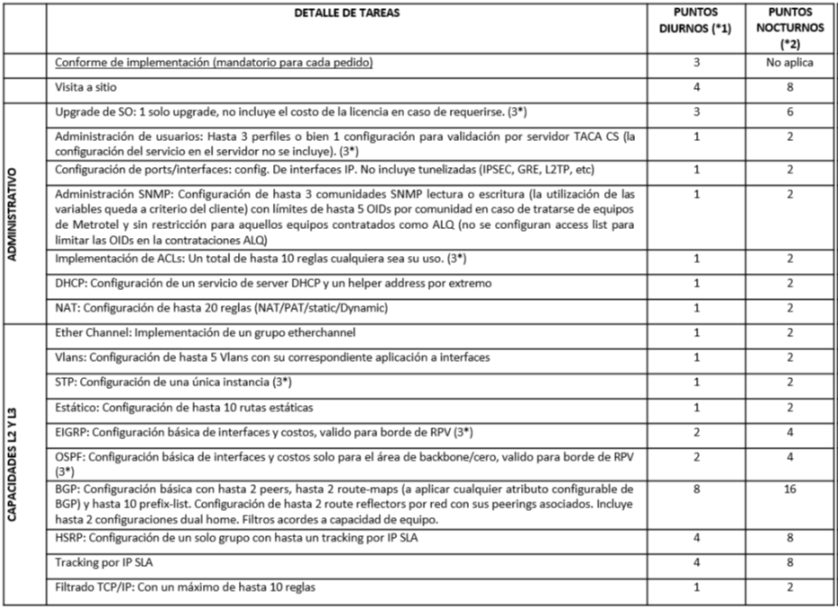
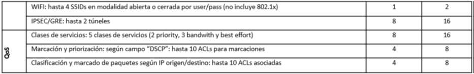

# ESPECIFICACIONES TÉCNICAS Y ALCANCE DE SERVICIO - SADM (SERVICIOS ADMINISTRADOS)

## 1. DESCRIPCIÓN GENERAL

Metrotel dispone de una línea completa de servicios administrados (SADM) para aquellos clientes que tienen la necesidad de delegar las tareas de configuración en determinados equipos provisto por Metrotel.

## 2. CARACTERÍSTICAS

El servicio SADM está disponible para su contratación bajo el esquema de paquetes de puntos. Dichos puntos tendrán vigencia anual o mensual, según el plan contratado, y podrán ser utilizados y canjeados de acuerdo al tipo de pedido realizado, descontándose el puntaje asociado a cada tarea.

## 3. ALCANCE DEL SERVICIO

Las tareas contempladas dentro del servicio SADMcubren necesidades de configuración de equipamiento del tipo:
+ Administrativo
+ Capacidades Layer 2 y Layer 3
+ QoS.
  
Toda tarea requerida dentro del servicio SADM, y sus correspondientes puntos, se instrumentan por equipo.

A continuación se detalla la lista de tareas contempladas dentro del servicio SADM y sus respectivos puntos dependiendo del horario de configuración requerido por el cliente.

(1*) *Se computaran como puntos diurnos a toda tarea que se requiera realizar los días hábiles entre las 9 hs y las 18 hs.*

(2*) *Se computaran como puntos nocturnos a toda tarea que se requiera realizar durante los días hábiles entre las 18 hsy las 9 hs y los fines de semana y feriados durante las 24 hs*

(3*) *Configuraciones validas solo para equipos contratados bajo el producto ALQ con el opcional de puesta en marcha.*

Las funcionalidades detalladas anteriormente podrán ser configuradas durante la implementación o una vez que se encuentre operativo el servicio de comunicaciones. Esta última opción deberá ser requerida mediante el ingreso de un ticket en nuestro centro de operaciones, quedando su implementación sujeta a la resolución de dicho ticket.

Una vez ingresado el ticket con el requerimiento de un servicio SADM, un profesional de Metrotel se comunicará con el cliente para revisar las necesidades, detallando las tareas a realizar y contabilizando los puntos a consumir de acuerdo al listado detallado anteriormente. Esta gestión por parte del especialista de Metrotel se realizara dentro de las 48 hs (días hábiles) posteriores al ingreso de ticket en el horario de 9 a 18 hs.

Una vez cerrado el alcance de utilización de servicios, mediante la firma de un documento con el cliente, se procederá a la ejecución de las tareas en el día y horario pactados, concluyéndose con la entrega de la documentación asociada y el cierre del ticket ingresado.

Cabe destacar que ante cualquier pedido se consumirán los puntos correspondientes al ítem de “Conforme de Implementación”, los mismos serán computados se realicen o no las tareas debido a que corresponden a la auditoría básica y relevamiento de parámetros de red (ya sea con el cliente o con equipos según corresponda).

Desde el ingreso del ticket con el pedido de configuración, y una vez realizada la auditoria y relevamiento por parte de personal de Metrotel, el cliente dispone de 5 días hábiles para aceptar o rechazar las tareas y, en caso de aceptarlas,de 2 meses para permitir la ejecución de las mismas, caso contrario se descontaran los puntos del conforme de implementación y se procederá al cierre del pedido.

En caso de que el puntaje adquirido por el cliente sea insuficiente para las tareas requeridas, deberá contactarse con el área comercial para adquirir un nuevo paquete de puntos, una vez que los puntos estén activos se procederá a la realización de las tareas.

Si la necesidad del cliente no se encuentra contemplada o supera los límites del alcance, deberá evaluarse la solución mediante especialistas de Metrotel, quienes encausaran el proyecto como “servicios administrados especiales” en el cual se explicara cómo llevar a cabo el proyecto, adjuntando la documentación, los alcances y límites correspondientes.

## 4. RESPONSABILIDAD DEL CLIENTE

El cliente será responsable de brindar toda la información necesaria a través de un único focal point por cada ejecución de SADM para configurar adecuadamente el servicio requerido, deberá cerrar el alcance del servicio a implementar y aceptar el cierre con la documentación técnica enviada oportunamente.

## 5. LÍMITES DEL SERVICIO

El servicio SADM está pensado para responder a las necesidades operativas más comunes en redes. Dichas necesidades son evaluadas en la preventa y de considerarse estándar se podrán contratar en paquetes de puntos. Luego en su implementación operativa se revisa el alcance particular y los límites. Para cada implementación, el servicio incluye una auditoría básica previa incluida de manera obligatoria como ítem “Conforme de Implementación” para asegurar la calidad del trabajo. Puede ocurrir que en esta etapa surjan requerimientos no contemplados, necesidad de detección de fallas (troubleshooting), o exigencias fuera del alcance descripto en el presente documento. En esos casos se le entregará al cliente un reporte del trabajo realizado conjuntamente con las necesidades detectadas y se dará por cumplimentado el servicio únicamente con los puntos asociados al ítem de “Conforme de Implementación”. El SADM no incluye ni contempla capacitación al cliente, transferencia de conocimientos ni entrega dedocumentación educacional.

